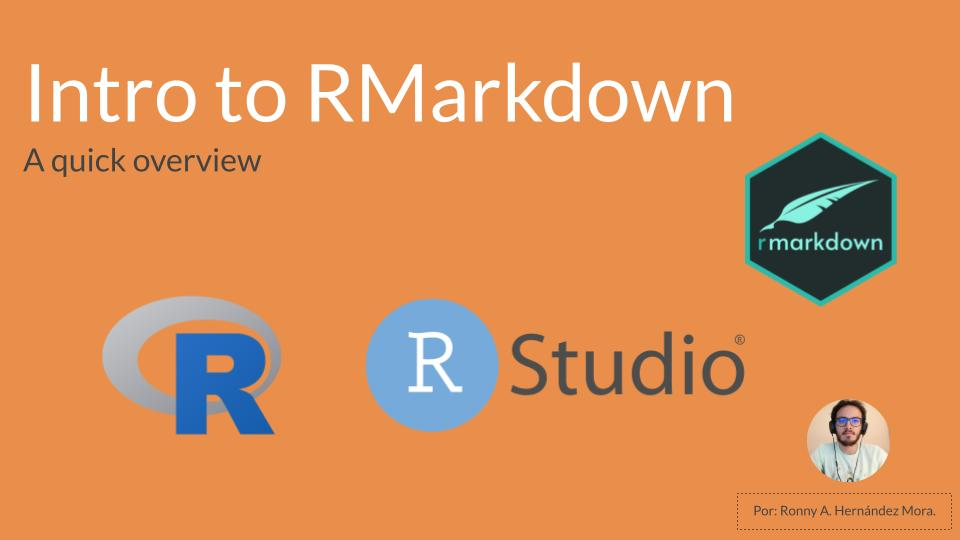

<!-- README.md is generated from README.Rmd. Please edit that file -->

```{r, include = FALSE}
knitr::opts_chunk$set(
  collapse = TRUE,
  comment = "#>"
)
```

# Introduction to RMarkdown <a href="https://www.youtube.com/watch?v=AjxgFVYMVnw"></a>

This is an introduction to RMarkdown for those who want to get quickly started
with the basics and play around with this tool.

A video with an explanation is [in youtube](https://www.youtube.com/watch?v=AjxgFVYMVnw)

The slides are saved as pdf [here](https://github.com/ronnyhdez/intro_rmarkdown/blob/main/slides/rmarkdown_seminar.pdf)

## Contents:

| file | URL | Description |
| ---- | --- | ----------- |
| basic_template.Rmd | [link](https://github.com/ronnyhdez/intro_rmarkdown/blob/main/basic_template.Rmd) | The template that comes by default with RMarkdown |
| baby_names_report.Rmd |[link](https://github.com/ronnyhdez/intro_rmarkdown/blob/main/baby_names_report.Rmd) | A file with example code and more steps in the YAML |
| baby_names_setup.RMD |[link](https://github.com/ronnyhdez/intro_rmarkdown/blob/main/baby_names_setup.Rmd) | The same file with code examples just with more tweaks in the YAML|

## References

Code used show data wrangling and visualizations comes from 
[Fiona Lees](https://github.com/fi-lees/tidy_tuesday/tree/master/2022/TT_2022_W12_BabyNames) from her contribution to the tidytuesday


