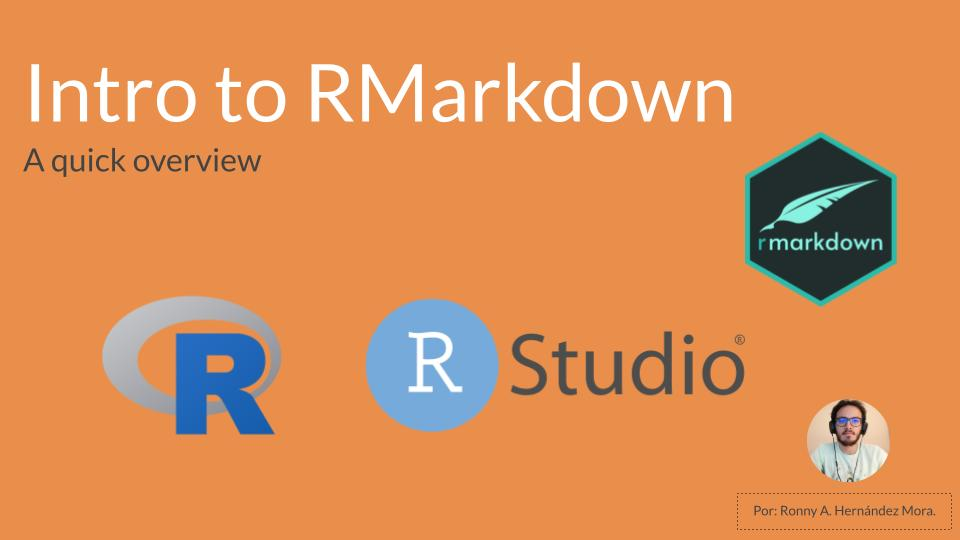

<!-- README.md is generated from README.Rmd. Please edit that file -->

# Introduction to RMarkdown 

This is an introduction to RMarkdown for those who want to get quickly
started with the basics and play around with this tool.

## Contents:

| file                    | URL | Description                                                        |
|-------------------------|-----|--------------------------------------------------------------------|
| basic\_template.Rmd     |     | The template that comes by default with RMarkdown                  |
| baby\_names\_report.Rmd |     | A file with example code and more steps in the YAML                |
| baby\_names\_setup.RMD  |     | The same file with code examples just with more tweaks in the YAML |

## References

Code used to create the generation data set and visualizations comes
from [Fiona
Lees](https://github.com/fi-lees/tidy_tuesday/tree/master/2022/TT_2022_W12_BabyNames)
